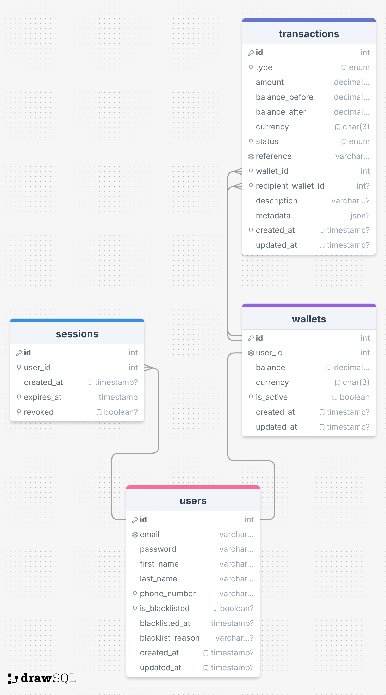

<p align="center">
  
</p>

# Lendsqr Backend

A robust, production-ready Node.js/TypeScript backend for Demo Credit, a mobile lending app that requires wallet functionality. Features include secure authentication, session management, wallet operations, transaction history, and automated API documentation.

---

## Table of Contents

- [Features](#features)
- [Architecture Overview](#architecture-overview)
- [Getting Started](#getting-started)
- [Environment Variables](#environment-variables)
- [Database & Migrations](#database--migrations)
- [Docker Usage](#docker-usage)
- [API Documentation (Swagger)](#api-documentation-swagger)
- [Core API Endpoints](#core-api-endpoints)
  - [Authentication](#authentication)
  - [User Profile](#user-profile)
  - [Wallet & Transactions](#wallet--transactions)
- [Testing](#testing)
- [Project Structure](#project-structure)
- [ER Diagram](#er-diagram)
- [License](#license)

---

## Features

- **User Registration & Login** with JWT and session management (sliding expiry).
- **Wallet Operations**: Fund, withdraw, transfer, and view wallet balance.
- **Transaction History**: View all wallet transactions.
- **Authorization** and secure route protection.
- **Automated Swagger/OpenAPI Documentation** at `/api-docs`.
- **MySQL 8.4** with Knex migrations.
- **Dockerized** for easy local and production deployment.
- **Comprehensive Testing** (unit, integration).
- **Prettier** for code formatting.
- **Makefile** for easy running of docker commands.

---

## Architecture Overview

- **Node.js** (TypeScript) with Express.
- **MySQL** database.
- **JWT** for stateless authentication, with session tracking for revocation and sliding expiry.
- **Knex ORM** for migrations and query building.
- **Swagger** for live API docs.
- **Docker** for containerized app and database.

---

## Getting Started

### Prerequisites

- [Docker](https://www.docker.com/get-started)
- [Node.js 22+](https://nodejs.org/) (for local dev outside Docker)
- [MySQL 8.4+](https://www.mysql.com/) (if not using Docker)

### Quick Start (Docker)

```sh
# Build and start the app and database
docker-compose up --build

# or use makefile see `./Makefile`
make up-build

# The API will be available at http://localhost:3000/api/v1
# Swagger docs: http://localhost:3000/api-docs
```

### Local Development

```sh
# Install dependencies
npm install

# Run database migrations
npm run migrate

# Start the app (ensure MySQL is running and .env is configured)
npm run dev
```

---

## Environment Variables

Set these in a `.env` file at the project root (see `src/config/common.config.ts`):

```
NODE_ENV=development
PORT=3000
DATABASE_HOST=localhost
DATABASE_PORT=3306
DATABASE_USERNAME=root
DATABASE_PASSWORD=databasepassword
DATABASE_NAME=lendsqr
JWT_SECRET=jwtsecret
```

---

## Database & Migrations

- **Migrations** are managed with Knex.
- To run migrations:

  ```sh
  npm run migrate
  ```

- To create a new migration:

  ```sh
  npm run migrate:make -- migration_name
  ```

- Database tables: `users`, `wallets`, `transactions`, `sessions`.

---

## Docker Usage

- **App**: Runs on Node 22 LTS, exposes port 3000.
- **Database**: MySQL 8.4, data persisted in Docker volume.
- **Configuration**: See `docker-compose.yml` for service details.

---

## API Documentation (Swagger)

- Live, interactive API docs available at:  
  [http://localhost:3000/api-docs](http://localhost:3000/api-docs)
- Docs are generated from JSDoc annotations and OpenAPI schemas.
- JWT Bearer authentication is supported in the docs UI.

---

## Core API Endpoints

### Authentication

- **POST `/api/v1/auth/register`**  
  Register a new user.  
  **Body:** `{ email, password, first_name, last_name, phone_number }`  
  **Response:** `{ accessToken }`

- **POST `/api/v1/auth/login`**  
  Login and receive JWT.  
  **Body:** `{ email, password }`  
  **Response:** `{ accessToken }`

### User Profile

- **GET `/api/v1/user/profile/`**  
  Get the authenticated user's profile.  
  **Auth:** Bearer JWT

### Wallet & Transactions

- **GET `/api/v1/user/wallet/`**  
  Get wallet details.  
  **Auth:** Bearer JWT

- **GET `/api/v1/user/wallet/transactions`**  
  List all wallet transactions.  
  **Auth:** Bearer JWT

- **POST `/api/v1/user/wallet/fund`**  
  Fund wallet.  
  **Body:** `{ amount, description?, metadata? }`  
  **Auth:** Bearer JWT

- **POST `/api/v1/user/wallet/withdraw`**  
  Withdraw funds.  
  **Body:** `{ amount, bank_details }`  
  **Auth:** Bearer JWT

- **POST `/api/v1/user/wallet/transfer`**  
  Transfer funds to another user.  
  **Body:** `{ recipient_user_id, amount, description? }`  
  **Auth:** Bearer JWT

---

## Testing

- **Run all tests:**
  ```sh
  npm test
  ```
- Tests are organized by type and domain in the `/tests` directory.

---

## Project Structure

```
src/
  controllers/      # Route controllers (auth, user, wallet)
  models/           # Database models
  services/         # Business logic (auth, wallet, session, user)
  middleware/       # Auth & authorization middleware
  routes/           # Route definitions
  utils/           # Utility functions
  validators/       # Zod schemas for validation
  lib/              # Shared libraries
  docs/             # Swagger/OpenAPI config
  config/           # App configurations
tests/              # Unit and integration tests
db/migrations/      # Knex migration files
```

---

## ER Diagram
>  View the live version on [here](https://dbdiagram.io/d/6655f6bb14a3c53b1e9b63c9)




---

## License

This project is licensed under the ISC License. 